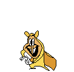

# bo_fucking_dies.gif

That one gif, but I actually modded it into [Super Bo Noise](https://puffballspeakerbox.itch.io/super-bo-noise). Go to Lake Eerie and watch Bo Noise fucking die from drinking the oil. I did not make the gif, idk where it came from originally.

# Installation

As Super Bo Noise was compiled with the YoYoCompiler, you can't modify the code with UndertaleModTool. Therefore, this mod was written in C++ for the [YYToolkit](https://github.com/AurieFramework/YYToolkit) mod loader.

1. Download the mod from the [Releases](/CST1229/bo_fucking_dies.gif/releases) page (it's a DLL file called `bo_fucking_dies.gif.dll`).
2. Get [Aurie Manager](https://github.com/AurieFramework/Aurie/releases) (which will allow you to install YYToolkit). You'll want to download just AurieManager.exe, not any of the other files
3. Run AurieManager.exe
4. Click "Add Game" and select Super Bo Noise's .exe
5. Click "Install Aurie"
6. Click "Add Mods" and select the `bo_fucking_dies.gif.dll` you downloaded
7. Click "Play Game" and hope it doesn't crash

# Compiling

idk

1. Get Visual Studio
2. Open the project
3. Build it
4. Add the output .dll as a mod in Aurie Manager